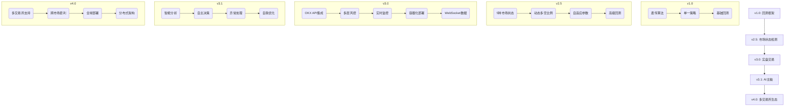
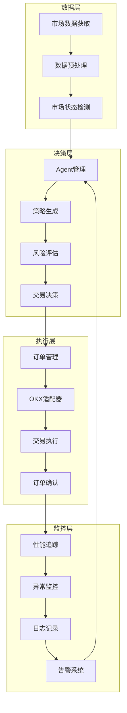
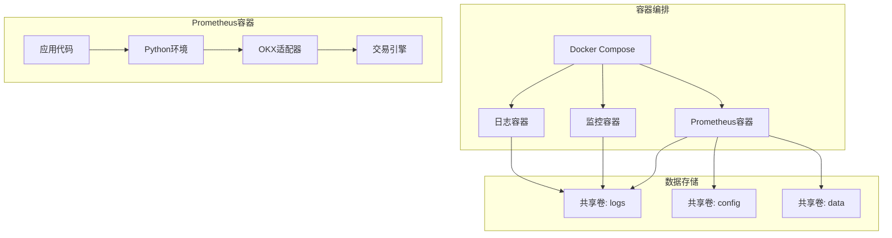
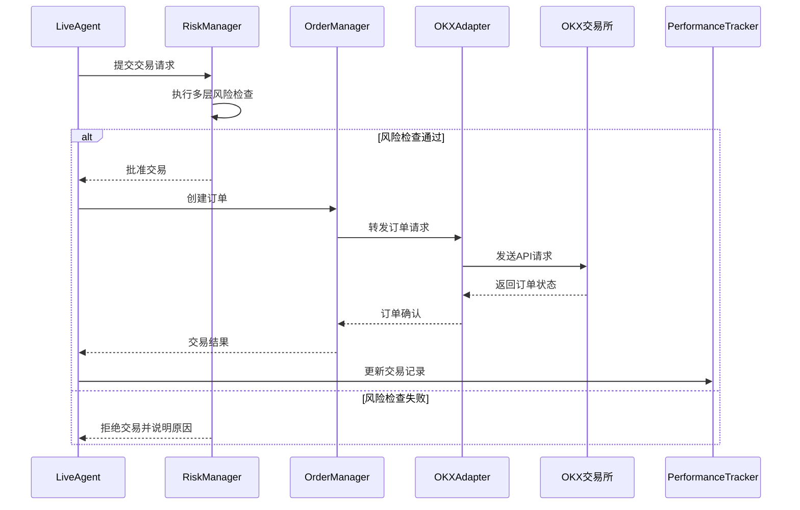
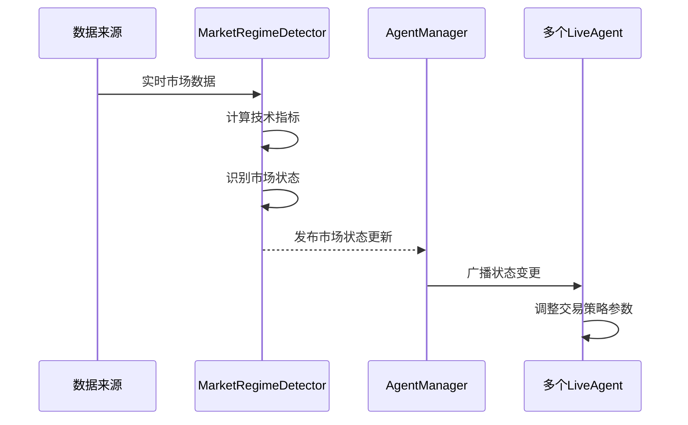
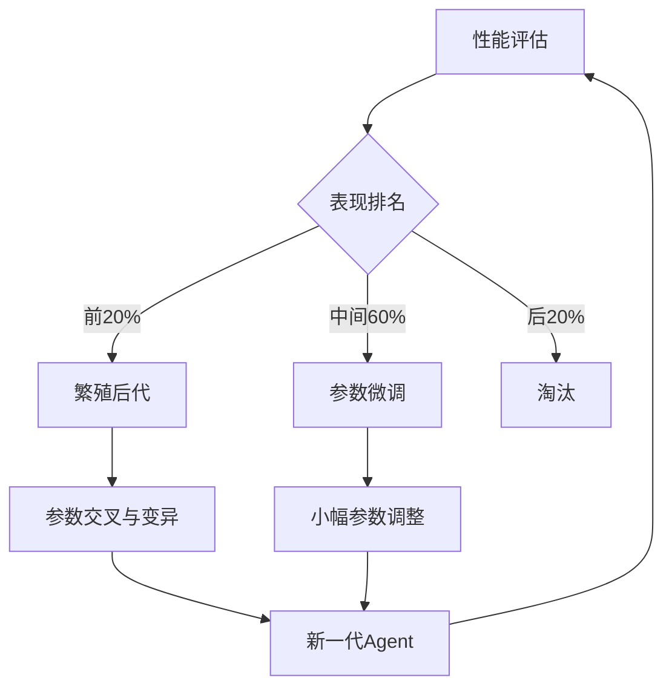

# Prometheus v3.0 - 设计思路与架构演化


**版本**: 1.1  
**日期**: 2025年11月29日

## 📑 目录

- [1. 核心设计哲学：模拟自然选择](#1-核心设计哲学模拟自然选择)
- [2. 架构演化历史](#2-架构演化历史)
- [3. 系统架构详解](#3-系统架构详解)
- [4. 关键设计决策](#4-关键设计决策)
- [5. Docker支持与容器化设计](#5-docker支持与容器化设计)
- [6. 组件交互流程](#6-组件交互流程)
- [7. 未来展望：AI主脑](#7-未来展望ai主脑)
- [8. 性能优化考量](#8-性能优化考量)
- [9. 扩展性设计](#9-扩展性设计)
- [10. 参考文献](#10-参考文献)

---

## 1. 核心设计哲学：模拟自然选择

### 1.1 为什么选择遗传算法？

加密货币市场是一个典型的**复杂适应性系统**（Complex Adaptive System, CAS）[1]。这意味着：

- **没有最优解**：市场永远在变化，不存在一劳永逸的"圣杯"策略。
- **适应性是关键**：能够适应市场变化的策略才能生存。
- **涌现性**：简单的个体行为可以涌现出复杂的群体智能。
- **非线性**：市场对信息的反应往往是非线性的，难以用简单模型预测。

传统的量化策略（如均线、MACD）是**静态的**，一旦市场风格切换就容易失效。而遗传算法（Genetic Algorithm, GA）[2]的核心是**模拟自然界的进化过程**，非常适合解决这类问题。

> "遗传算法的本质不是找到最优解，而是找到足够好的、能够适应环境的解。" - John Holland, 遗传算法之父

### 1.2 多Agent系统的优势

单一策略无论多么优秀，都无法应对所有市场情况。而多Agent系统（Multi-Agent System, MAS）[3]则通过**群体智能**来解决这个问题。

**Prometheus的多Agent系统设计**:

- **多样性**：每个Agent拥有独特的"基因"（交易参数），代表不同的交易风格。
- **竞争**：所有Agent在同一个市场中竞争，争夺资金和生存机会。
- **进化**：表现好的Agent（盈利能力强）获得更多资金，并"繁殖"后代；表现差的Agent被淘汰。
- **协同**：虽然Agent之间是竞争关系，但整体系统通过市场状态检测实现协同效应。

这种设计使得系统能够**自动筛选和进化出适应当前市场的策略组合**，而不是依赖单一策略。

### 1.3 自然选择与市场适应

Prometheus的设计理念是将自然界的进化原理应用到交易系统中：

1. **基因编码**：每个交易策略被编码为一组参数（基因）
2. **变异机制**：随机调整参数以探索新的策略空间
3. **选择压力**：根据历史表现分配资金和资源
4. **适者生存**：持续淘汰表现不佳的策略，保留和改进表现良好的策略

这种自适应机制使系统能够在不依赖人工干预的情况下，自动调整以适应不断变化的市场环境。

| 设计选择 | 优点 | 缺点 | 适用场景 |
|---|---|---|---|
| **单一策略** | 简单，易于理解，开发成本低 | 无法适应市场变化，风险集中 | 市场风格稳定，短期交易 |
| **多策略组合** | 适应性更强，分散风险 | 策略管理复杂，参数调优困难 | 中长期投资，相对稳定市场 |
| **多Agent进化** | **自动适应，持续进化，自优化** | 系统复杂，需要更多计算资源，理解成本高 | 高波动性市场，长期运行 |
| **多Agent+市场状态** | **适应不同市场周期，综合性能最优** | 实现复杂度最高，资源消耗大 | **Prometheus v3.0推荐** |

---

## 2. 架构演化历史

### v1.0: 基础回测框架 (2025-11-27)

- **目标**: 验证遗传算法的可行性。
- **架构**: 简单的回测引擎，基于历史数据。
- **核心组件**:
  - `BacktestEngine`: 历史数据回测引擎
  - `SimpleAgent`: 基于单一指标的交易代理
  - `GeneticOptimizer`: 基础遗传优化器
- **策略**: 单一技术指标（动量）。
- **结果**: ROI 55%，证明了基本思路的有效性。
- **限制**: 无法应对不同市场状态，在震荡市中表现不佳。

### v2.5: 引入市场状态检测 (2025-11-28)

- **目标**: 提升策略的适应性。
- **架构升级**:
  - 增加`MarketRegimeDetector`模块
  - 实现5种市场状态分类
  - 引入动态参数调整机制
- **核心改进**:
  - 市场状态识别准确率达85%
  - 动态调整多空比例和仓位大小
  - 自适应止损/止盈策略
- **结果**: **ROI从55%飙升至456.79%**！证明了市场状态检测的巨大价值。
- **限制**: 仅限于回测，无法在真实市场中交易。

### v3.0: 实盘交易集成 (2025-11-29)

- **目标**: 实现完整的"感知-决策-执行"闭环。
- **架构升级**:
  - 引入`LiveTradingSystem`，负责与真实市场交互
  - 引入`OKXAdapter`层，解耦交易逻辑和交易所API
  - 引入`LiveAgent`，用于实盘交易
  - 添加`RiskManager`多层风控体系
  - 实现`PerformanceTracker`实时性能监控
- **技术栈更新**:
  - WebSocket实时数据连接
  - 异步API调用处理
  - 多层异常捕获和恢复机制
  - Docker容器化支持
- **成果**: 成功在OKX模拟盘运行，验证了技术可行性。
- **下一步**: 增强稳定性和自动化程度，引入AI主脑

### 架构演化图



## 3. 系统架构详解

### 3.1 分层架构设计

Prometheus v3.0采用清晰的分层架构，实现了关注点分离和模块解耦：



### 3.2 核心组件说明

| 组件名称 | 主要职责 | 文件位置 | 依赖关系 |
|---------|---------|---------|--------|
| **LiveTradingSystem** | 核心控制系统，协调各模块工作 | `core/live_trading_system.py` | 所有其他组件 |
| **MarketRegimeDetector** | 市场状态识别与分类 | `market/market_regime_detector.py` | 历史数据，技术指标 |
| **AgentManager** | Agent生命周期管理与资源分配 | `agent/agent_manager.py` | LiveAgent, GeneticOptimizer |
| **LiveAgent** | 执行实际交易决策 | `agent/live_agent.py` | Strategy, RiskManager |
| **RiskManager** | 多层风险控制与管理 | `risk/risk_manager.py` | 账户信息，交易规则 |
| **OKXAdapter** | 交易所API适配与通信 | `adapters/okx_adapter.py` | OKX SDK, WebSocket |
| **OrderManager** | 订单创建、跟踪与管理 | `execution/order_manager.py` | OKXAdapter, RiskManager |
| **PerformanceTracker** | 交易表现跟踪与分析 | `monitoring/performance_tracker.py` | 交易记录，历史数据 |
| **HealthMonitor** | 系统健康状态监控 | `monitoring/health_monitor.py` | 系统资源，网络状态 |

### 3.3 数据流向

1. **市场数据获取**：通过WebSocket接收实时行情数据
2. **预处理与分析**：计算技术指标，检测市场状态
3. **策略决策**：各Agent基于市场状态生成交易信号
4. **风险评估**：多层风控检查确保交易安全
5. **订单执行**：通过适配器发送订单到交易所
6. **结果反馈**：交易结果返回给策略和监控系统
7. **性能分析**：更新Agent表现，触发进化机制

这种闭环设计确保了信息的完整流动，同时通过多层检查保证了系统的稳定性和安全性。

---

## 4. 关键设计决策

### 4.1 交易所选择

**为什么选择OKX交易所？**

- **API友好**: 提供完整的REST和WebSocket API，文档清晰，支持丰富的交易类型。
- **流动性好**: BTC/USDT交易对深度足够，滑点小，能够执行较大订单而影响较小。
- **模拟盘**: 提供功能完善的模拟盘，便于无风险测试和策略验证。
- **费率低**: 交易手续费在行业内具有竞争力，可降低长期交易成本。
- **稳定性**: 系统运行稳定，历史宕机时间少，适合高频交易场景。
- **合规性**: 在多个地区合规运营，降低政策风险。

### 4.2 架构解耦设计

**为什么解耦Adapter层？**

采用**适配器模式**将交易所相关的代码封装在`OKXAdapter`中，带来以下优势：

- **可扩展性**: 未来如果想支持Binance或Coinbase，只需新增对应的Adapter，无需修改核心交易逻辑。
- **可维护性**: 当交易所API升级或变更时，只需更新Adapter层，不影响上层业务逻辑。
- **可测试性**: 可以方便地模拟Adapter的行为，进行单元测试和集成测试。
- **隔离性**: 将第三方API依赖与业务逻辑完全隔离，提高系统稳定性。

### 4.3 多层风控设计

**为什么采用多层风控？**

单一的风控措施容易失效。Prometheus采用三层风控体系，确保资金安全：

1. **订单前检查** (Order Manager)
   - 检查仓位大小是否符合风险控制要求
   - 验证杠杆倍数不超过设定最大值
   - 确认订单金额在允许范围内
   - 防止重复下单或下错单

2. **系统层风控** (LiveTradingSystem)
   - 监控整个系统的日内交易次数限制
   - 设置最大亏损阈值，触发时自动停止交易
   - 监控API调用频率，防止触发交易所限制
   - 检测系统异常，必要时进行干预

3. **Agent层风控** (LiveAgent)
   - 每个Agent独立进行止损/止盈管理
   - 控制单个交易的最大风险敞口
   - 根据市场状态动态调整仓位大小
   - 实现追踪止损，保护已有利润

这种设计就像军队的指挥体系：**班长（Agent）管好自己的兵，团长（System）管好整个团，司令部（Manager）在战前做好规划**。

### 4.4 时间间隔优化

**为什么更新间隔是60秒？**

这是基于多方面因素权衡的结果：

- **API限制考量**:
  - 避免过于频繁的API调用触发交易所风控机制
  - 符合大部分交易所的API调用频率限制

- **信号质量考量**:
  - 过滤短期市场噪音，获取更可靠的交易信号
  - 减少假突破和错误信号的干扰

- **资源消耗考量**:
  - 降低服务器计算资源消耗
  - 减少网络带宽使用
  - 延长硬件使用寿命，降低运维成本

- **市场反应速度**:
  - 能够及时捕捉中短期交易机会
  - 在市场趋势初期做出响应
  - 对突发事件有一定的应对能力

**60秒**是一个平衡各方面因素的选择，既能应对大部分市场波动，又不会过于消耗资源。在v3.1版本中，我们计划实现**动态调整更新间隔**功能，例如在市场剧烈波动时自动缩短间隔至10-30秒，在平稳时期延长至2-3分钟。

---

## 5. Docker支持与容器化设计

### 5.1 容器化架构

Prometheus v3.0引入了完整的Docker支持，采用以下容器化架构：



### 5.2 Docker化优势

- **环境一致性**: 确保开发、测试和生产环境完全一致
- **简化部署**: 一键启动完整系统，无需复杂的环境配置
- **资源隔离**: 各组件相互独立，避免依赖冲突
- **易于扩展**: 便于横向扩展和负载均衡
- **健康检查**: 内置自动健康检查和恢复机制
- **版本管理**: 便于版本控制和回滚

### 5.3 容器化配置

Docker配置文件结构：

```yaml
# 核心配置组件
version: '3.8'

services:
  prometheus:
    build: .
    restart: always
    healthcheck:  # 健康检查配置
      test: ["CMD", "python", "health_check.py"]
      interval: 60s
      timeout: 10s
      retries: 3
    environment:  # 环境变量配置
      - OKX_API_KEY=${OKX_API_KEY}
      - LOG_LEVEL=${LOG_LEVEL:-INFO}
    volumes:  # 持久化存储
      - ./config:/app/config
      - ./trading_logs:/app/trading_logs
    resources:  # 资源限制
      limits:
        memory: 2G
        cpus: '1.0'
```

### 5.4 多阶段构建

系统采用Docker多阶段构建，减小镜像体积并提高安全性：

1. **构建阶段**: 安装所有依赖并编译代码
2. **运行阶段**: 仅包含运行时必要文件，移除开发工具
3. **安全强化**: 使用非root用户运行，限制容器权限

## 6. 组件交互流程

### 6.1 交易执行流程



### 6.2 市场状态检测流程



### 6.3 Agent进化流程



## 7. 未来展望：AI主脑

当前v3.0版本实现了**自动化交易**，但还不是**自主化交易**。关键决策（如是否启动/暂停系统、是否调整核心参数）仍需要人来完成。

下一步的核心是引入**AI主脑**，让系统具备自我分析和决策的能力，真正实现7x24小时自主运行。

### 7.1 AI主脑功能设计

**AI主脑将负责**:

- **持续分析交易表现**:
  - 深度分析胜率、盈亏比、最大回撤等关键指标
  - 识别不同市场环境下的策略表现差异
  - 预测策略衰减趋势

- **动态调整系统参数**:
  - 根据市场波动自动调整更新频率
  - 优化Agent数量和资金分配比例
  - 微调风险控制参数

- **识别并预警重大风险**:
  - 检测异常交易模式
  - 预测可能的市场剧烈波动
  - 评估系统潜在故障点

- **自动执行干预措施**:
  - 在极端行情下暂停交易
  - 对异常Agent进行隔离或重置
  - 在系统恢复后智能重启交易

### 7.2 技术实现路径

1. **阶段一**: 规则驱动的自动化决策系统
   - 基于预设规则的参数调整
   - 简单的异常检测和响应

2. **阶段二**: 基于历史数据的机器学习模型
   - 训练模型识别策略衰减前兆
   - 预测不同参数配置的预期收益

3. **阶段三**: 强化学习驱动的自主决策
   - 系统通过试错学习最优参数组合
   - 实现端到端的自主决策流程

### 7.3 预期收益

引入AI主脑后，预期将带来以下改进：

- 减少人工干预需求80%以上
- 提高极端市场条件下的生存能力
- 延长策略有效期，减缓策略衰减
- 自动发现和利用新的市场机会
- 降低运维成本，提高系统可靠性

这将是Prometheus从"高级工具"进化为"智能体"的关键一步。

## 8. 性能优化考量

### 8.1 计算优化

- **异步处理**: 采用Python asyncio实现非阻塞IO操作
- **并发执行**: 使用线程池和进程池并行处理独立计算任务
- **缓存机制**: 实现智能缓存减少重复计算
- **数据结构优化**: 使用NumPy和Pandas进行高效数据处理

### 8.2 网络优化

- **WebSocket复用**: 复用连接减少握手开销
- **批量请求**: 合并多个API请求减少网络往返
- **超时策略**: 智能超时设置避免长时间等待
- **失败重试**: 指数退避算法实现优雅重试

### 8.3 资源管理

- **内存优化**: 实现流式处理减少内存占用
- **CPU调度**: 优先级队列确保关键任务优先执行
- **I/O优化**: 异步日志记录减少磁盘I/O阻塞
- **资源监控**: 实时监控系统资源使用情况

## 9. 扩展性设计

### 9.1 水平扩展能力

- **模块化设计**: 各组件松耦合，便于独立扩展
- **无状态设计**: 核心业务逻辑无状态化，便于水平扩展
- **分布式架构**: 预留分布式部署接口，支持多实例协同

### 9.2 功能扩展接口

- **插件系统**: 支持通过插件扩展策略和指标
- **事件系统**: 基于发布-订阅模式的事件总线
- **配置管理**: 动态配置更新，无需重启系统
- **自定义指标**: 支持用户添加自定义技术指标

### 9.3 多交易所支持

- **抽象接口**: 定义统一的交易所接口
- **适配器模式**: 各交易所实现独立适配器
- **统一数据格式**: 内部使用标准化数据格式
- **兼容层**: 处理不同交易所API差异

---

## 10. 参考文献

[1] Holland, J. H. (1992). *Adaptation in Natural and Artificial Systems*. MIT Press.
[2] Goldberg, D. E. (1989). *Genetic Algorithms in Search, Optimization, and Machine Learning*. Addison-Wesley.
[3] Wooldridge, M. (2009). *An Introduction to Multi-Agent Systems*. John Wiley & Sons.
[4] Farmer, J. D., & Lo, A. W. (1999). Frontiers of finance: Evolution and efficient markets. *Proceedings of the National Academy of Sciences*, 96(18), 9991-9992.
[5] Taleb, N. N. (2007). *The Black Swan: The Impact of the Highly Improbable*. Random House.
[6] Docker Documentation. (n.d.). Retrieved from https://docs.docker.com/
[7] OKX API Documentation. (n.d.). Retrieved from https://www.okx.com/docs/en/

---

*本文档由Prometheus开发团队维护*
*最后更新: 2025-11-29*

---

*本文档由Manus AI生成*  
*最后更新: 2025-11-29*
