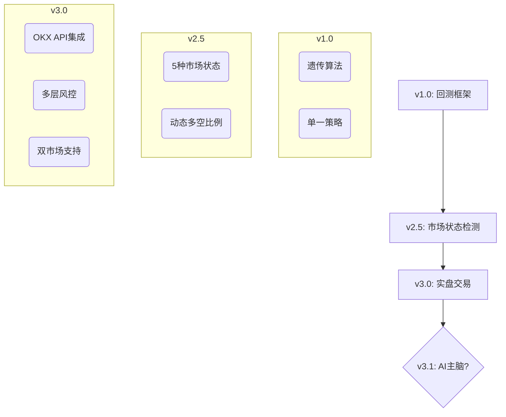

# Prometheus v3.0 - 设计思路与架构演化

**版本**: 1.0  
**日期**: 2025年11月29日

---

## 1. 核心设计哲学：模拟自然选择

### 1.1 为什么选择遗传算法？

加密货币市场是一个典型的**复杂适应性系统**（Complex Adaptive System, CAS）[1]。这意味着：

- **没有最优解**：市场永远在变化，不存在一劳永逸的"圣杯"策略。
- **适应性是关键**：能够适应市场变化的策略才能生存。
- **涌现性**：简单的个体行为可以涌现出复杂的群体智能。

传统的量化策略（如均线、MACD）是**静态的**，一旦市场风格切换就容易失效。而遗传算法（Genetic Algorithm, GA）[2]的核心是**模拟自然界的进化过程**，非常适合解决这类问题。

> "遗传算法的本质不是找到最优解，而是找到足够好的、能够适应环境的解。" - John Holland, 遗传算法之父

### 1.2 为什么是多Agent系统？

单一策略无论多么优秀，都无法应对所有市场情况。而多Agent系统（Multi-Agent System, MAS）[3]则通过**群体智能**来解决这个问题。

**Prometheus的多Agent系统设计**:

- **多样性**：每个Agent拥有独特的"基因"（交易参数），代表不同的交易风格。
- **竞争**：所有Agent在同一个市场中竞争，争夺资金和生存机会。
- **进化**：表现好的Agent（盈利能力强）获得更多资金，并"繁殖"后代；表现差的Agent被淘汰。

这种设计使得系统能够**自动筛选和进化出适应当前市场的策略组合**，而不是依赖单一策略。

| 设计选择 | 优点 | 缺点 |
|---|---|---|
| **单一策略** | 简单，易于理解 | 无法适应市场变化 |
| **多策略组合** | 适应性更强 | 策略管理复杂 |
| **多Agent进化** | **自动适应，持续进化** | 系统复杂，需要更多计算资源 |

---

## 2. 架构演化历史

### v1.0: 基础回测框架 (2025-11-27)

- **目标**: 验证遗传算法的可行性。
- **架构**: 简单的回测引擎，基于历史数据。
- **策略**: 单一技术指标（动量）。
- **结果**: ROI 55%，证明了基本思路的有效性。
- **问题**: 无法应对不同市场状态，在震荡市中表现不佳。

### v2.5: 引入市场状态检测 (2025-11-28)

- **目标**: 提升策略的适应性。
- **架构**: 增加了`MarketRegimeDetector`模块。
- **策略**: Agent会根据5种市场状态（强牛/弱牛/震荡/弱熊/强熊）调整交易行为。
- **结果**: **ROI从55%飙升至456.79%**！证明了市场状态检测的巨大价值。
- **问题**: 仅限于回测，无法在真实市场中交易。

### v3.0: 实盘交易集成 (2025-11-29)

- **目标**: 实现完整的"感知-决策-执行"闭环。
- **架构**: 
  - 引入`LiveTradingSystem`，负责与真实市场交互。
  - 引入`OKXAdapter`层，解耦交易逻辑和交易所API。
  - 引入`LiveAgent`，用于实盘交易。
- **结果**: 成功在OKX模拟盘运行，验证了技术可行性。
- **问题**: 需要更长时间的测试来验证策略在真实市场中的表现。

### 架构演化图

---

## 3. 关键设计决策

### 3.1 为什么选择OKX交易所？

- **API友好**: 提供完整的REST和WebSocket API，文档清晰。
- **流动性好**: BTC/USDT交易对深度足够，滑点小。
- **模拟盘**: 提供功能完善的模拟盘，便于无风险测试。
- **费率低**: 交易手续费在行业内具有竞争力。

### 3.2 为什么解耦Adapter层？

将交易所相关的代码（如API调用、数据格式转换）封装在`OKXAdapter`中，有以下好处：

- **可扩展性**: 未来如果想支持Binance或Coinbase，只需新增一个`BinanceAdapter`，而无需修改核心交易逻辑。
- **可维护性**: 交易所API会升级，我们只需修改Adapter层，不影响上层业务。
- **可测试性**: 可以方便地模拟Adapter的行为，进行单元测试。

### 3.3 为什么采用多层风控？

单一的风控措施容易失效。Prometheus采用三层风控体系，确保资金安全：

1. **订单前检查** (Order Manager)
   - 在下单前检查仓位、杠杆、订单金额，防止下错单。

2. **系统层风控** (LiveTradingSystem)
   - 监控整个系统的日内交易次数和最大亏损，防止系统失控。

3. **Agent层风控** (LiveAgent)
   - 每个Agent独立进行止损/止盈，控制单个交易的风险。

这种设计就像军队的指挥体系：**班长（Agent）管好自己的兵，团长（System）管好整个团，司令部（Manager）在战前做好规划**。

### 3.4 为什么更新间隔是60秒？

这是一个权衡的结果：

- **太短（如5秒）**: 
  - API调用过于频繁，可能触发交易所风控。
  - 产生大量噪音信号，影响决策。
  - 增加服务器成本。

- **太长（如1小时）**: 
  - 无法捕捉短线交易机会。
  - 市场发生剧变时反应迟钝。

**60秒**是一个比较均衡的选择，既能应对大部分市场波动，又不会过于消耗资源。未来可以考虑**动态调整更新间隔**，例如在市场剧烈波动时缩短间隔。

---

## 4. 未来展望：AI主脑

当前v3.0版本实现了**自动化交易**，但还不是**自主化交易**。关键决策（如是否启动/暂停系统、是否调整核心参数）仍需要人来完成。

下一步的核心是引入**AI主脑**（方案A），让系统具备自我分析和决策的能力，真正实现7x24小时自主运行。

**AI主脑将负责**:
- 持续分析交易表现
- 动态调整系统参数
- 识别并预警重大风险
- 自动执行干预措施

这将是Prometheus从"高级工具"进化为"智能体"的关键一步。

---

## 参考文献

[1] Holland, J. H. (1992). *Adaptation in Natural and Artificial Systems*. MIT Press.
[2] Goldberg, D. E. (1989). *Genetic Algorithms in Search, Optimization, and Machine Learning*. Addison-Wesley.
[3] Wooldridge, M. (2009). *An Introduction to Multi-Agent Systems*. John Wiley & Sons.

---

*本文档由Manus AI生成*  
*最后更新: 2025-11-29*
