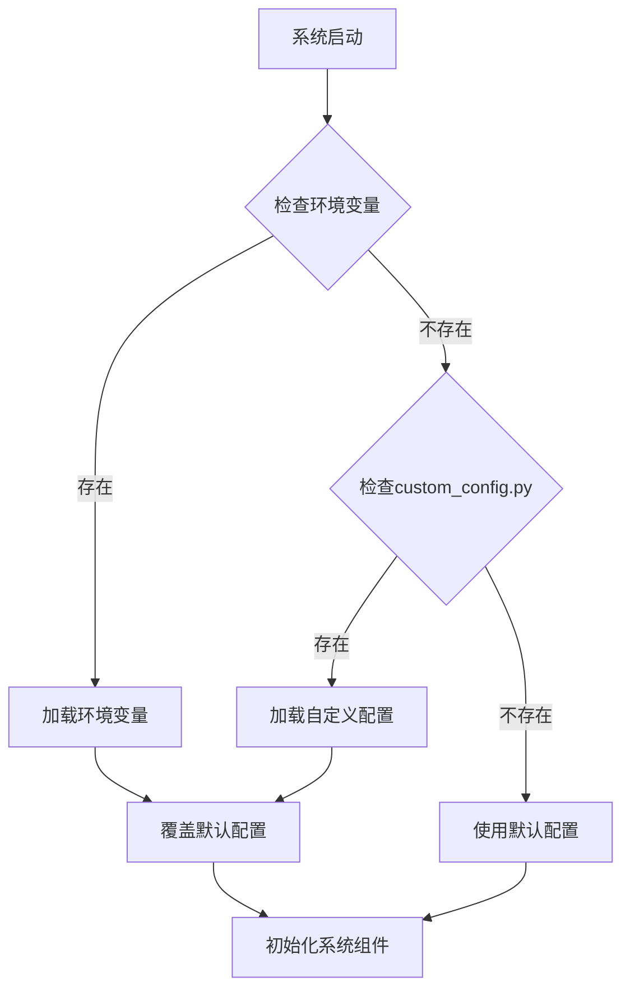

# Prometheus v3.0 - 参数详解与调优指南


**版本**: 1.1  
**日期**: 2025年11月29日

## 📑 目录

- [1. 参数设计哲学：在混沌中寻找秩序](#1-参数设计哲学在混沌中寻找秩序)
- [2. 配置文件结构](#2-配置文件结构)
- [3. 系统级参数 (`config_virtual.py`)](#3-系统级参数-config_virtualpy)
- [4. 市场配置参数 (`markets`)](#4-市场配置参数-markets)
- [5. 风控参数 (`risk`)](#5-风控参数-risk)
- [6. Agent基因参数 (`live_agent.py`)](#6-agent基因参数-live_agentpy)
- [7. 市场状态检测参数 (`market_regime.py`)](#7-市场状态检测参数-market_regimepy)
- [8. Docker环境参数](#8-docker环境参数)
- [9. 监控与日志参数](#9-监控与日志参数)
- [10. 调优指南](#10-调优指南)
- [11. 配置示例](#11-配置示例)
- [12. 最佳实践](#12-最佳实践)
- [13. 常见问题解答](#13-常见问题解答)

---

## 1. 参数设计哲学：在混沌中寻找秩序

Prometheus系统的参数设计遵循以下原则：

- **分层设计**: 参数按功能和影响范围进行清晰分层
- **可扩展性**: 支持配置文件、环境变量和Docker参数多源配置
- **安全性优先**: 风控参数默认设置为保守值，确保资金安全
- **自适应**: 核心交易参数通过遗传算法动态优化

### 1.1 参数分类体系

Prometheus系统的参数分为六大类：

1.  **系统级参数**：决定系统的宏观运行方式和资源分配
2.  **市场配置参数**：定义交易市场和资金分配策略
3.  **风控参数**：系统的"安全带"，决定风险承受能力
4.  **Agent基因参数**：决定每个Agent的微观交易行为，是进化的核心
5.  **环境配置参数**：Docker和部署环境相关设置
6.  **监控与日志参数**：系统监控和日志记录相关配置

> "参数调优的艺术，不在于找到一个完美的组合，而在于理解每个参数背后的行为逻辑，并让它们协同工作。"

### 1.2 参数优先级

当参数在多个位置定义时，应用以下优先级规则：

1. **Docker环境变量**（最高优先级）
2. **自定义配置文件** (`custom_config.py`)
3. **默认配置文件** (`config_virtual.py`)
4. **硬编码默认值**（最低优先级）

这种设计确保了在不同部署环境下的灵活性和一致性。

## 2. 配置文件结构

### 2.1 标准配置文件

```
config/
├── config_virtual.py    # 默认配置，包含所有参数的详细说明
└── custom_config.py     # 自定义配置，用于覆盖默认值
```

### 2.2 Docker环境下的配置

```
docker/
├── docker-compose.yml   # Docker Compose配置
├── .env.example         # 环境变量示例文件
└── .env                 # 实际环境变量文件（不提交到版本控制）
```

### 2.3 配置加载流程



---

## 3. 系统级参数 (`config_virtual.py`)

这些参数定义了系统的基本框架和运行节奏，对系统整体性能和资源占用有重要影响。

| 参数 | 默认值 | 类型 | 环境变量名 | 含义 | 调优建议 |
|---|---|---|---|---|---|
| `initial_capital` | 5000 | float | `INITIAL_CAPITAL` | 初始总资金 | 根据您的实际情况设置。建议从模拟盘开始。 |
| `initial_agents` | 5 | int | `INITIAL_AGENTS` | 初始Agent数量 | **建议5-10个**。太少则多样性不足，太多则计算资源消耗大。 |
| `max_agents` | 10 | int | `MAX_AGENTS` | 最大Agent数量 | **建议为初始数量的2-3倍**。用于控制种群规模，防止无限繁殖。 |
| `update_interval` | 60 | int | `UPDATE_INTERVAL` | 系统更新间隔（秒） | **60秒是均衡选择**。短于30秒可能触发API频率限制，长于300秒可能错过机会。 |
| `order_timeout` | 300 | int | `ORDER_TIMEOUT` | 订单超时时间（秒） | **建议300-600秒**。如果订单在此时限内未成交，将被取消。 |
| `retry_attempts` | 3 | int | `RETRY_ATTEMPTS` | API调用重试次数 | **建议3-5次**。用于应对网络波动或API临时错误。 |
| `api_rate_limit` | 60 | int | `API_RATE_LIMIT` | 每分钟最大API调用次数 | 根据交易所限制调整。OKX默认限制为60次/分钟。 |
| `gene_mutation_rate` | 0.1 | float | `GENE_MUTATION_RATE` | 基因变异率 | 建议0.05-0.15之间。值越高多样性越强，但稳定性可能降低。 |
| `evolve_interval` | 86400 | int | `EVOLVE_INTERVAL` | 进化周期（秒） | 默认24小时。决定Agent种群多久进化一次。 |
| `keep_best_agents` | 0.2 | float | `KEEP_BEST_AGENTS` | 保留最优Agent比例 | 默认保留20%最优Agent。用于保证进化过程中的优质基因不会丢失。 |

### 3.1 资源相关参数

| 参数 | 默认值 | 类型 | 环境变量名 | 含义 | 调优建议 |
|---|---|---|---|---|---|
| `max_memory_usage` | 2048 | int | `MAX_MEMORY_USAGE` | 最大内存使用量（MB） | 根据服务器配置调整。Docker环境下自动受容器限制。 |
| `max_cpu_usage` | 1.0 | float | `MAX_CPU_USAGE` | 最大CPU使用率（核心数） | 根据服务器配置调整。Docker环境下自动受容器限制。 |
| `worker_threads` | 4 | int | `WORKER_THREADS` | 工作线程数量 | 建议为CPU核心数的0.5-1倍。影响并发处理能力。 |

### 3.2 开发与调试参数

| 参数 | 默认值 | 类型 | 环境变量名 | 含义 | 调优建议 |
|---|---|---|---|---|---|
| `debug_mode` | False | bool | `DEBUG_MODE` | 调试模式开关 | 生产环境必须关闭。开启后会输出详细日志。 |
| `dry_run` | True | bool | `DRY_RUN` | 模拟交易模式 | 初始使用时建议开启，熟悉系统后再关闭。 |
| `log_level` | "INFO" | str | `LOG_LEVEL` | 日志级别 | 可选：DEBUG, INFO, WARNING, ERROR, CRITICAL |

## 4. 市场配置参数 (`markets`)

市场配置定义了交易的具体市场、交易对和资金分配策略。

### 4.1 默认市场配置

```python
'markets': {
    'spot': {
        'enabled': True,
        'symbol': 'BTC-USDT',
        'allocation': 0.5,  # 50%资金分配给现货
        'max_order_size': 0.2,  # 单笔最大订单比例
        'min_order_size': 0.001  # 单笔最小订单比例
    },
    'futures': {
        'enabled': True,
        'symbol': 'BTC-USDT-SWAP',
        'allocation': 0.5,  # 50%资金分配给合约
        'max_leverage': 3,   # 最大杠杆倍数
        'min_leverage': 1,   # 最小杠杆倍数
        'auto_deleverage': False  # 是否允许自动减仓
    }
}
```

### 4.2 市场参数详解

| 参数 | 默认值 | 类型 | 环境变量名 | 适用市场 | 含义 | 调优建议 |
|---|---|---|---|---|---|---|
| `enabled` | True | bool | - | spot/futures | 是否启用该市场 | 可以只启用一个市场进行测试 |
| `symbol` | "BTC-USDT" | str | - | spot | 现货交易对 | OKX支持的现货交易对 |
| `symbol` | "BTC-USDT-SWAP" | str | - | futures | 合约交易对 | OKX支持的合约交易对 |
| `allocation` | 0.5 | float | - | spot/futures | 资金分配比例 | **建议现货和合约各占50%**，以分散风险 |
| `max_leverage` | 3 | int | `MAX_LEVERAGE` | futures | 最大杠杆倍数 | **强烈建议新手不要超过3倍**。高杠杆是爆仓的主要原因 |
| `min_leverage` | 1 | int | - | futures | 最小杠杆倍数 | 通常为1，不建议修改 |
| `max_order_size` | 0.2 | float | - | spot/futures | 单笔最大订单比例 | 单笔订单使用该市场资金的最大比例 |
| `min_order_size` | 0.001 | float | - | spot/futures | 单笔最小订单比例 | 防止下单过小的无效订单 |
| `auto_deleverage` | False | bool | - | futures | 是否允许自动减仓 | 建议关闭，以避免极端情况下的强制平仓 |

### 4.3 多交易对配置示例

高级用户可以配置多个交易对进行分散化交易：

```python
'markets': {
    'spot': {
        'enabled': True,
        'symbols': [  # 多交易对配置
            {'pair': 'BTC-USDT', 'allocation': 0.3},
            {'pair': 'ETH-USDT', 'allocation': 0.2}
        ]
    },
    'futures': {
        'enabled': True,
        'symbols': [
            {'pair': 'BTC-USDT-SWAP', 'allocation': 0.3, 'max_leverage': 3},
            {'pair': 'ETH-USDT-SWAP', 'allocation': 0.2, 'max_leverage': 2}
        ]
    }
}
```

> **注意**：多交易对配置需要更多的计算资源和API调用次数，建议在系统稳定运行后再尝试。

---

## 5. 风控参数 (`risk`)

风控参数是系统的生命线，决定了系统能承受多大的风险。请务必谨慎调整这些参数，尤其是在实盘环境中。

### 5.1 核心风控参数

| 参数 | 默认值 | 类型 | 环境变量名 | 含义 | 调优建议 |
|---|---|---|---|---|---|
| `max_daily_trades` | 100 | int | `MAX_DAILY_TRADES` | 每日最大交易次数 | **建议100-200次**。防止系统在异常行情下失控刷单。 |
| `max_daily_loss` | 0.10 | float | `MAX_DAILY_LOSS` | 每日最大亏损比例 | **核心风控参数**。当总资金亏损达到10%时，系统将暂停所有交易。**建议0.05-0.15**。 |
| `max_drawdown` | 0.20 | float | `MAX_DRAWDOWN` | 最大回撤比例 | 当从最高点回撤达到20%时，系统将暂停交易。**建议0.15-0.30**。 |
| `max_leverage` | 3 | int | `GLOBAL_MAX_LEVERAGE` | 全局最大杠杆 | 即使合约市场设置了更高杠杆，也会被此参数限制。**是最后的保险丝**。 |
| `max_position_pct` | 0.30 | float | `MAX_POSITION_PCT` | 单笔订单最大仓位 | 单笔订单使用的资金不能超过总资金的30%。**建议0.2-0.5**。 |
| `stop_loss_pct` | 0.05 | float | `DEFAULT_STOP_LOSS_PCT` | 默认止损比例 | 如果Agent基因中的止损参数异常，将使用此默认值。 |
| `max_order_value` | 500 | float | `MAX_ORDER_VALUE` | 单笔订单最大金额 | 防止下出天价单。**建议设置为`initial_capital`的10%左右**。 |

### 5.2 风控触发后的行为参数

| 参数 | 默认值 | 类型 | 环境变量名 | 含义 | 调优建议 |
|---|---|---|---|---|---|
| `cool_down_period` | 3600 | int | `COOL_DOWN_PERIOD` | 风控触发后的冷却期（秒） | 默认1小时。风控触发后，系统将在此时间段内暂停交易。 |
| `notify_on_risk_trigger` | True | bool | `NOTIFY_ON_RISK_TRIGGER` | 是否在风控触发时发送通知 | 建议开启，以便及时了解系统状态。 |
| `close_positions_on_risk` | True | bool | `CLOSE_POSITIONS_ON_RISK` | 风控触发时是否自动平仓 | 实盘环境建议开启，模拟盘可以关闭以便分析。 |

### 5.3 高级风控设置

```python
'risk': {
    # 基础风控参数...
    
    # 高级风控设置
    'advanced': {
        'market_volatility_threshold': 0.05,  # 市场波动率阈值
        'volatility_check_window': 3600,      # 波动率检查窗口（秒）
        'circuit_breaker': {
            'enabled': True,
            'price_drop_threshold': 0.15,     # 价格下跌触发熔断阈值
            'volume_spike_threshold': 3.0,    # 成交量暴增触发熔断阈值
            'cooldown_minutes': 30            # 熔断冷却时间（分钟）
        },
        'anti_martingale': {
            'enabled': True,
            'base_position_size': 0.05,       # 基础仓位大小
            'max_position_size': 0.25,        # 最大仓位大小
            'loss_multiplier': 1.5            # 亏损后的仓位调整倍数
        }
    }
}
```

> **重要提示**：风控参数的调整应基于充分的回测和模拟盘测试。在实盘环境中，建议从保守的设置开始，随着对系统理解的深入再逐步调整。 |

---

## 6. Agent基因参数 (`live_agent.py`)

Agent基因参数是遗传算法的核心，决定了Agent的多样性和进化方向。每个Agent在诞生时会随机生成一套基因，并在进化过程中不断优化。

### 6.1 基础基因参数

| 参数 | 默认范围 | 类型 | 环境变量名 | 含义 | 调优建议 |
|---|---|---|---|---|---|
| `long_threshold` | 0.05-0.15 | float | - | 做多信号阈值 | **核心策略参数**。当动量指标超过此值时触发做多。值越小越激进。 |
| `short_threshold` | -0.15--0.05 | float | - | 做空信号阈值 | 当动量指标低于此值时触发做空。值越大越激进。 |
| `max_position` | 0.5-1.0 | float | - | 最大仓位比例 | Agent自身资金的最大使用比例。**建议0.8-1.0**，让Agent充分利用资金。 |
| `stop_loss` | 0.03-0.08 | float | - | 止损百分比 | **决定Agent的生存能力**。太小容易被震荡止损，太大则亏损严重。 |
| `take_profit` | 0.05-0.15 | float | - | 止盈百分比 | **决定Agent的盈利能力**。太小赚得少，太大则容易回吐利润。 |
| `holding_period` | 300-3600 | int | - | 持仓周期（秒） | Agent愿意持仓的最长时间。**建议300-7200秒（5分钟-2小时）**。 |
| `risk_aversion` | 0.5-1.5 | float | - | 风险厌恶系数 | **影响Agent的决策偏好**。值越高，Agent越倾向于规避风险。 |
| `entry_confirmation` | 1-3 | int | - | 入场确认次数 | 需要连续多少次信号确认才入场。防止假突破。 |
| `exit_confirmation` | 1-2 | int | - | 出场确认次数 | 需要连续多少次信号确认才出场。避免过早离场。 |
| `market_regime_weight` | 0.3-0.7 | float | - | 市场状态权重 | 市场状态对交易决策的影响权重。 |

### 6.2 高级基因参数

| 参数 | 默认范围 | 类型 | 含义 | 调优建议 |
|---|---|---|---|---|
| `trailing_stop_enabled` | True/False | bool | 是否启用追踪止损 | 建议启用，可提高利润保护能力。 |
| `trailing_stop_distance` | 0.02-0.05 | float | 追踪止损距离 | 止损价格与当前价格的最小距离。 |
| `position_scaling` | 0.1-0.3 | float | 仓位缩放因子 | 分批建仓时每批的比例。 |
| `profit_taking_strategy` | 0-2 | int | 利润获取策略 | 0:一次性, 1:分批, 2:动态调整 |
| `drawdown_recovery` | 0.5-1.5 | float | 回撤恢复系数 | 回撤后调整风险偏好的系数。 |

### 6.3 基因变异机制

当一个优秀的Agent"繁殖"后代时，后代的基因会在父代的基础上发生**轻微变异**。变异机制如下：

```python
# 基因变异示例
def mutate_gene(parent_gene_value, mutation_rate=0.1, gene_range=None):
    # 根据变异率决定是否变异
    if random.random() < mutation_rate:
        # 高斯变异，均值为父代基因值，标准差为父代基因值的10%
        new_value = parent_gene_value * (1 + random.gauss(0, 0.1))
        
        # 如果有范围限制，确保新值在范围内
        if gene_range:
            new_value = max(gene_range[0], min(gene_range[1], new_value))
            
        return new_value
    return parent_gene_value
```

### 6.4 基因编码与解码

基因参数在系统内部以标准化的方式进行编码和解码：

```python
def encode_gene(gene_value, gene_min, gene_max):
    # 将基因值标准化到[0,1]区间
    return (gene_value - gene_min) / (gene_max - gene_min)

def decode_gene(encoded_value, gene_min, gene_max):
    # 将[0,1]区间的值解码回原始范围
    return encoded_value * (gene_max - gene_min) + gene_min
```

这种编码方式使得不同参数范围的基因可以在统一的空间内进行操作，有利于遗传算法的高效运行。

---

## 7. 市场状态检测参数 (`market_regime.py`)

市场状态检测参数决定了系统如何识别和响应不同的市场环境，是系统适应不同市场条件的关键。

### 7.1 基础市场状态定义

| 状态 | 30日涨跌幅定义 | 技术指标特征 | 交易策略建议 |
|---|---|---|---|
| **Strong Bull** | 涨幅 > 20% | 波动率低，趋势强，RSI中高 | 适合追涨，增加做多Agent权重 |
| **Weak Bull** | 涨幅 5-20% | 波动率中等，趋势向上 | 适合逢低做多，平衡配置 |
| **Sideways** | 涨跌幅 ±5% | 波动率低，趋势不明显 | 适合高抛低吸或观望，降低仓位 |
| **Weak Bear** | 跌幅 5-20% | 波动率中等，趋势向下 | 适合逢高做空，偏向做空配置 |
| **Strong Bear** | 跌幅 > 20% | 波动率高，趋势强，RSI低 | 适合追空，增加做空Agent权重 |

### 7.2 高级市场状态检测参数

```python
'market_regime': {
    # 基础参数
    'lookback_period': 30,  # 回看周期（日）
    'volatility_period': 14,  # 波动率计算周期
    'confirmation_threshold': 2,  # 状态确认所需的连续天数
    
    # 技术指标权重
    'indicators': {
        'price_change_weight': 0.5,  # 价格变化权重
        'volatility_weight': 0.2,    # 波动率权重
        'trend_strength_weight': 0.2,  # 趋势强度权重
        'momentum_weight': 0.1       # 动量权重
    },
    
    # 动态调整参数
    'dynamic_adjustment': {
        'enabled': True,
        'adjustment_period': 30,  # 调整周期（日）
        'min_threshold_change': 0.01  # 最小调整幅度
    }
}
```

### 7.3 为什么选择30日作为基础周期？

30日是一个经过测试的平衡选择：

- **太短（如7日）**: 容易被短期噪音干扰，产生虚假信号
- **适中（30日）**: 能够反映中期趋势，同时对市场变化保持足够敏感
- **太长（如90日）**: 对市场变化反应迟钝，错过重要转折点

### 7.4 市场状态转换规则

市场状态的转换遵循一定的规则，以避免频繁切换：

1. **状态确认**: 市场状态需要连续`confirmation_threshold`天满足条件才会正式切换
2. **渐进式调整**: 资金分配在状态转换时采用渐进式调整，避免剧烈波动
3. **回补确认**: 对于快速反转的市场状态，系统会要求额外的确认信号

这种设计使得系统能够平滑应对市场状态的变化，避免因短期波动导致的过度交易。

---

## 8. Docker环境参数

在Docker环境中运行Prometheus时，可以通过环境变量和Docker Compose配置来管理参数。

### 8.1 环境变量配置

```env
# API相关配置
OKX_API_KEY=your_api_key_here
OKX_API_SECRET=your_api_secret_here
OKX_API_PASSPHRASE=your_api_passphrase_here

# 系统配置
INITIAL_CAPITAL=5000
INITIAL_AGENTS=5
UPDATE_INTERVAL=60
DRY_RUN=true

# 风险控制
MAX_DAILY_LOSS=0.1
MAX_LEVERAGE=3

# 日志和监控
LOG_LEVEL=INFO
ENABLE_METRICS=true
METRICS_PORT=8000
```

### 8.2 Docker Compose配置示例

```yaml
version: '3.8'

services:
  prometheus:
    image: prometheus:v3.0
    container_name: prometheus_trading
    restart: unless-stopped
    volumes:
      - ./config:/app/config
      - ./logs:/app/logs
      - ./data:/app/data
    environment:
      # 从.env文件加载环境变量
      - OKX_API_KEY=${OKX_API_KEY}
      - OKX_API_SECRET=${OKX_API_SECRET}
      - OKX_API_PASSPHRASE=${OKX_API_PASSPHRASE}
      - INITIAL_CAPITAL=${INITIAL_CAPITAL:-5000}
      - INITIAL_AGENTS=${INITIAL_AGENTS:-5}
      - MAX_DAILY_LOSS=${MAX_DAILY_LOSS:-0.1}
      - LOG_LEVEL=${LOG_LEVEL:-INFO}
      - DRY_RUN=${DRY_RUN:-true}
    ports:
      - "8000:8000"  # 监控指标端口
    healthcheck:
      test: ["CMD", "python", "/app/health_check.py"]
      interval: 1m
      timeout: 10s
      retries: 3
    resources:
      limits:
        memory: 2G
        cpus: '1.0'
```

### 8.3 Docker特有参数

| 参数 | 默认值 | 类型 | 环境变量名 | 含义 | 调优建议 |
|---|---|---|---|---|---|
| `docker_health_check_interval` | 60 | int | - | 健康检查间隔（秒） | 建议60-300秒。根据系统稳定性调整。 |
| `docker_log_rotation_size` | "100M" | str | - | 日志轮转大小 | 建议"100M"-"500M"。防止日志占用过多磁盘空间。 |
| `docker_data_persistence` | true | bool | - | 是否持久化数据 | 生产环境建议开启，确保数据不丢失。 |
| `docker_restart_policy` | "unless-stopped" | str | - | 容器重启策略 | 建议"unless-stopped"。确保系统自动恢复。 |

## 9. 监控与日志参数

### 9.1 日志配置

| 参数 | 默认值 | 类型 | 环境变量名 | 含义 | 调优建议 |
|---|---|---|---|---|---|
| `log_level` | "INFO" | str | `LOG_LEVEL` | 日志级别 | 可选：DEBUG, INFO, WARNING, ERROR, CRITICAL |
| `log_format` | "json" | str | `LOG_FORMAT` | 日志格式 | 可选：json, text。生产环境推荐json格式。 |
| `log_file` | "/app/logs/prometheus.log" | str | `LOG_FILE` | 日志文件路径 | Docker环境下建议使用默认路径。 |
| `log_rotation` | true | bool | `LOG_ROTATION` | 是否开启日志轮转 | 建议开启，避免日志文件过大。 |
| `log_backup_count` | 7 | int | `LOG_BACKUP_COUNT` | 保留的历史日志文件数量 | 建议3-14天。根据磁盘空间调整。 |

### 9.2 监控指标配置

```python
'monitoring': {
    'enabled': True,
    'port': 8000,
    'metrics_path': '/metrics',
    'collection_interval': 60,  # 指标收集间隔（秒）
    'metrics': {
        'system': True,  # 系统资源指标
        'trading': True,  # 交易性能指标
        'agents': True,  # Agent表现指标
        'risk': True      # 风险指标
    }
}
```

### 9.3 通知配置

```python
'notifications': {
    'enabled': True,
    'channels': {
        'email': {
            'enabled': False,
            'smtp_server': '',
            'smtp_port': 587,
            'sender': '',
            'recipients': [],
            'username': '',
            'password': ''
        },
        'telegram': {
            'enabled': False,
            'bot_token': '',
            'chat_id': ''
        }
    },
    'events': {
        'daily_report': True,
        'risk_alerts': True,
        'trade_executions': False,  # 大量交易时建议关闭
        'system_status': True
    }
}
```

## 10. 调优指南

### 10.1 新手入门

- **不要修改任何参数**，直接使用默认配置在模拟盘运行至少一周
- 观察系统在不同市场条件下的表现，了解基本行为模式
- 熟悉日志和监控输出，学会解读系统状态

### 10.2 风险偏好调整

**保守型配置**
```python
# custom_config.py
def get_custom_config():
    return {
        'risk': {
            'max_daily_loss': 0.05,  # 降低到5%
            'max_leverage': 2,        # 降低到2倍
        },
        'agent_gene_ranges': {
            'risk_aversion': (0.8, 1.5)  # 提高风险厌恶系数下限
        }
    }
```

**激进型配置**
```python
# custom_config.py
def get_custom_config():
    return {
        'risk': {
            'max_daily_loss': 0.15,   # 提高到15%
            'max_leverage': 5,        # 提高到5倍
        },
        'agent_gene_ranges': {
            'risk_aversion': (0.5, 1.2)  # 降低风险厌恶系数上限
        }
    }
```

### 10.3 交易频率调整

**高频交易配置**
```python
# 缩短更新间隔
UPDATE_INTERVAL = 30  # 秒

# 调整基因范围
'agent_gene_ranges': {
    'long_threshold': (0.03, 0.10),    # 降低阈值，更易触发
    'short_threshold': (-0.10, -0.03),
    'holding_period': (120, 1800)      # 缩短持仓时间
}
```

**低频交易配置**
```python
# 延长更新间隔
UPDATE_INTERVAL = 180  # 秒

# 调整基因范围
'agent_gene_ranges': {
    'long_threshold': (0.08, 0.20),    # 提高阈值，更难触发
    'short_threshold': (-0.20, -0.08),
    'holding_period': (1800, 10800)    # 延长持仓时间
}
```

### 10.4 策略类型调整

**趋势跟踪策略**
```python
'agent_gene_ranges': {
    'holding_period': (3600, 14400),    # 1-4小时
    'take_profit': (0.08, 0.20),        # 更大的止盈目标
    'stop_loss': (0.03, 0.06),          # 相对较小的止损
    'entry_confirmation': (2, 4)        # 更多的确认信号
}
```

**震荡市策略**
```python
'agent_gene_ranges': {
    'holding_period': (300, 1800),      # 5分钟-30分钟
    'take_profit': (0.02, 0.08),        # 较小的止盈目标
    'stop_loss': (0.02, 0.05),          # 较小的止损
    'market_regime_weight': (0.5, 0.8)  # 更重视市场状态
}
```

### 10.5 系统性能调优

对于资源受限的环境，可以通过以下参数优化性能：

```python
# 减少Agent数量
INITIAL_AGENTS = 3
MAX_AGENTS = 6

# 减少计算频率
UPDATE_INTERVAL = 120  # 延长到2分钟

# 减少日志和监控开销
'logging': {
    'log_level': 'WARNING',  # 提高日志级别
    'detailed_trade_logs': False
},
'monitoring': {
    'collection_interval': 300  # 延长指标收集间隔
}
```

## 11. 配置示例

### 11.1 保守型实盘配置

```python
# custom_config.py
def get_custom_config():
    return {
        'initial_capital': 10000,
        'initial_agents': 5,
        'max_agents': 10,
        'update_interval': 60,
        'dry_run': False,
        
        'markets': {
            'spot': {
                'enabled': True,
                'symbol': 'BTC-USDT',
                'allocation': 0.7  # 更多资金配置到现货
            },
            'futures': {
                'enabled': True,
                'symbol': 'BTC-USDT-SWAP',
                'allocation': 0.3,  # 较少资金配置到合约
                'max_leverage': 2   # 低杠杆
            }
        },
        
        'risk': {
            'max_daily_trades': 50,
            'max_daily_loss': 0.05,
            'max_drawdown': 0.15,
            'max_leverage': 2,
            'max_position_pct': 0.2,
            'close_positions_on_risk': True
        },
        
        'agent_gene_ranges': {
            'risk_aversion': (0.8, 1.5),
            'stop_loss': (0.03, 0.06),
            'holding_period': (1800, 7200)
        },
        
        'logging': {
            'log_level': 'INFO',
            'log_format': 'json'
        },
        
        'notifications': {
            'enabled': True,
            'channels': {
                'telegram': {
                    'enabled': True,
                    'bot_token': 'your_token',
                    'chat_id': 'your_chat_id'
                }
            },
            'events': {
                'daily_report': True,
                'risk_alerts': True,
                'trade_executions': True
            }
        }
    }
```

### 11.2 Docker生产环境配置

```yaml
# docker-compose.yml
version: '3.8'

services:
  prometheus:
    image: prometheus:v3.0
    container_name: prometheus_trading
    restart: unless-stopped
    volumes:
      - ./config:/app/config
      - prometheus_logs:/app/logs
      - prometheus_data:/app/data
    environment:
      - OKX_API_KEY=${OKX_API_KEY}
      - OKX_API_SECRET=${OKX_API_SECRET}
      - OKX_API_PASSPHRASE=${OKX_API_PASSPHRASE}
      - INITIAL_CAPITAL=20000
      - INITIAL_AGENTS=7
      - MAX_AGENTS=14
      - UPDATE_INTERVAL=60
      - DRY_RUN=false
      - MAX_DAILY_LOSS=0.08
      - MAX_LEVERAGE=3
      - LOG_LEVEL=INFO
    ports:
      - "8000:8000"
    healthcheck:
      test: ["CMD", "python", "/app/health_check.py"]
      interval: 1m
      timeout: 10s
      retries: 3
    resources:
      limits:
        memory: 4G
        cpus: '2.0'

  prometheus_monitor:
    image: prom/prometheus:latest
    container_name: prometheus_monitor
    restart: unless-stopped
    volumes:
      - ./monitoring/prometheus.yml:/etc/prometheus/prometheus.yml
      - prometheus_metrics:/prometheus
    ports:
      - "9090:9090"
    depends_on:
      - prometheus

volumes:
  prometheus_logs:
  prometheus_data:
  prometheus_metrics:
```

## 12. 最佳实践

### 12.1 参数调优原则

1.  **渐进式调整**：不要一次性修改多个重要参数
2.  **数据驱动**：每次调整都应有明确的数据支持和预期
3.  **模拟先行**：新参数组合必须先在模拟盘验证至少一周
4.  **保守起步**：实盘初期使用相对保守的参数设置
5.  **持续记录**：详细记录每次调整及其效果

### 12.2 不同市场环境的参数调整

| 市场环境 | 风险参数调整 | Agent基因调整 | 其他建议 |
|---|---|---|---|
| **高波动期** | 降低`max_daily_loss`<br>降低`max_leverage`<br>减少`max_position_pct` | 提高`stop_loss`<br>降低`take_profit`<br>提高`risk_aversion` | 延长`update_interval`<br>启用熔断机制 |
| **低波动期** | 保持默认值 | 降低`long_threshold`/`short_threshold`<br>缩短`holding_period` | 增加`initial_agents`<br>提高变异率 |
| **趋势明确期** | 可适当放宽`max_daily_loss` | 延长`holding_period`<br>提高`take_profit` | 调整市场权重，增加趋势跟踪Agent比例 |
| **震荡整理期** | 降低`max_position_pct` | 增加`entry_confirmation`<br>缩小`take_profit`/`stop_loss` | 启用动态仓位调整 |

### 12.3 性能与稳定性平衡

在配置系统时，需要在性能和稳定性之间找到平衡点：

- **提高性能的配置**通常会增加系统资源消耗和风险
- **提高稳定性的配置**通常会降低交易频率和潜在收益

根据您的风险偏好和硬件条件，选择合适的配置平衡点。

## 13. 常见问题解答

### 13.1 如何确定最优的Agent数量？

**答**：Agent数量取决于您的计算资源和市场复杂度：
- 资源有限：建议5-8个Agent
- 资源充足：可以尝试10-20个Agent
- 初始阶段：从较少数量开始，逐步增加
- 记住：**质量优于数量**，10个精心设计的Agent可能比20个随机Agent表现更好

### 13.2 为什么我的系统在震荡市表现不佳？

**答**：这是常见问题，可能的解决方法：
1. 调整市场状态检测参数，提高震荡市识别准确率
2. 增加`entry_confirmation`值，减少假突破入场
3. 缩小`take_profit`和`stop_loss`范围，适应小波动
4. 启用动态仓位调整，在震荡市自动降低仓位

### 13.3 Docker环境和本地环境参数设置有区别吗？

**答**：基本参数设置相同，但Docker环境有几点特殊考虑：
1. 资源限制：设置适当的内存和CPU限制
2. 环境变量：敏感信息（如API密钥）应通过环境变量传入
3. 数据持久化：确保关键数据通过卷挂载持久化
4. 健康检查：配置适当的健康检查参数

### 13.4 如何配置多交易对？

**答**：在`markets`配置中使用`symbols`数组而不是单个`symbol`：
```python
'markets': {
    'spot': {
        'enabled': True,
        'symbols': [
            {'pair': 'BTC-USDT', 'allocation': 0.4},
            {'pair': 'ETH-USDT', 'allocation': 0.3},
            {'pair': 'SOL-USDT', 'allocation': 0.3}
        ]
    }
}
```

### 13.5 参数调优需要多长时间？

**答**：参数调优是一个持续的过程：
- 初步适应期：至少1-2周的模拟盘运行
- 基础调优：1-2个月的实盘观察和调整
- 持续优化：系统运行期间的定期评估和微调

> **重要提示**：参数调优没有终点，市场在不断变化，策略也需要持续适应。保持耐心，关注长期表现而非短期波动。

---

*本文档由Prometheus开发团队维护*
*最后更新: 2025年11月29日*

*本文档由AI生成并由人工优化*  
*最后更新: 2025-11-29*
